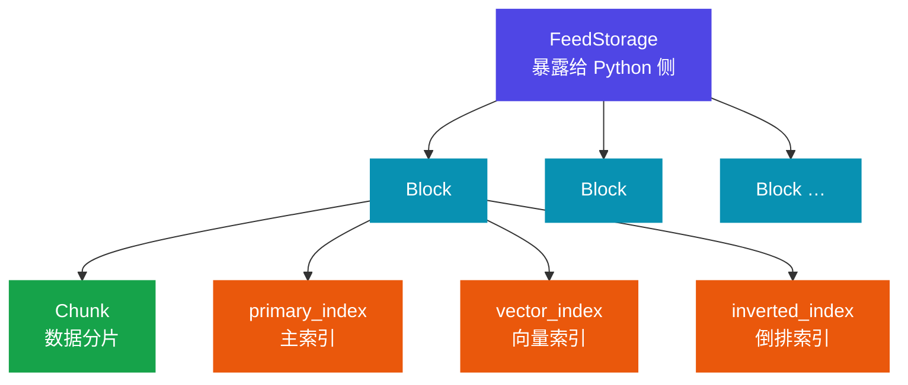
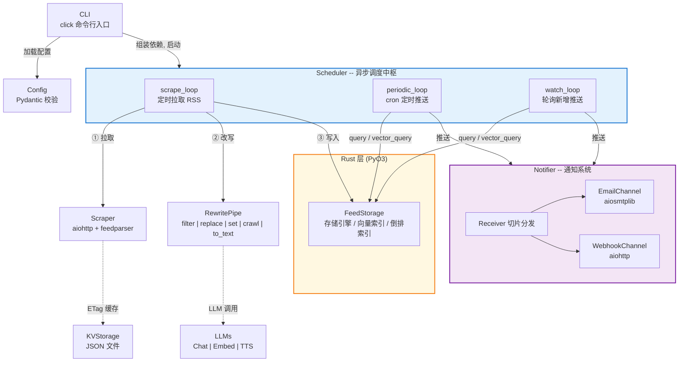

> 一个采用 Python 和 Rust（核心存储引擎）实现的信息处理管道，基本上就是照着 Zenfeed 原项目照抄了哈哈哈

## 前言及项目介绍

这个项目是我最近这个月以来，打算开始系统性培养开发能力的作品吧，因为不懂业务逻辑，也没想出啥能做的好用的工具，于是在看到了 GitHub 上的这个 Zenfeed 项目以后，就搭建了这个简易的复刻版。原项目仓库链接

<https://github.com/glidea/zenfeed>

个人感觉，虽然这个小工具功能设计和实现的，好像都不太完善，不过在写这个项目的过程当中确实非常好的锻炼了我的开发能力，嘻。尤其是当时在 Rust 那边实现 feed 的存储引擎的时候，好多次都感觉自己脑子要炸了，层出不穷的错误……

个人仓库的地址：<https://github.com/Aumnnertic/zenfeed-py>

个人现在看来的优点：

- 模块设计，低耦合，有协议边界
- 带了异步及多线程，相比于原 Go 写的项目，rust 设计的存储引擎性能更佳
- 边界情况和错误处理基本完善
- 第三方库依赖少，代码逻辑清晰

缺点也很明显：

- 很多函数/功能设计的其实很简陋/简单，毕竟这个项目个人维护到现在也就才二十多天
- 并不了解代码格式化工具，所以很多地方写的很乱（现已修复）
- 没有好的分支管理习惯（虽然这是我独立开发）

## 核心数据模型

Feed，持有 Labels 对象作为属性，可以根据需要灵活配置标签，在该项目里作为 rewrite 管道的核心依赖

```rust
pub struct Feed {
    #[pyo3(get)]
    pub id: u64,

    pub labels: Labels,
    
    #[pyo3(get)]
    pub time: i64,
}

pub struct Labels {
    pub inner: Vec<(String, String)>,
}
```

通过 pyo3 和 Python 侧桥接，通过 from_dict 方法完成 python 侧的字典向 rust 侧元组列表的转换，labels 采用二分插入，始终保持按标签键字典序排列

```rust
#[staticmethod]
fn from_dict(labels: HashMap<String, String>, time: i64) -> Feed {
    Feed { id: 0, labels: Labels::from_map(labels), time }
}
```

## Rust 侧存储引擎

### 整体设计

关键判断：每条 feed 信息基本都只会进行一次写操作，且 read 后基本不会再看，因此基于 feed 的这类特点，参考时序数据库（TSDB）设计了这个存储引擎



### 关键技术决策

- Block 的划分

对于一个 RSS 抓取&处理工具来说，对 feed 的持久化策略不能是全塞到一个文件里，内存，时间和序列化开销都是问题。因此针对 feed 天然带时间戳的特点，项目采用了以时间窗口来划分 block 的方法，这样也能天然应对带时间范围的查询请求。时间归属计算见下：

```rust
fn feed_belong_cal(t0: i64, t: i64, window: i64) -> i64 {
    t0 + ((t - t0) / window) * window
}
```

- Block 冷热状态机

存储引擎针对于低内存进行了特别优化——block 采用 Hot/Cold 状态机，hot 状态的 block 加载在内存当中，cold 状态的持久化到磁盘里，并在 manifest 里写入磁盘索引，通过在"任一时刻最多同时有一个 block"的规则，显著优化了程序在低内存机器上的性能表现

- FeedStorage 类通过 manifest 管理 block 的元数据

针对上述的 block 划分和状态机设计，项目采用了 manifest 类来帮助 feedstorage 协调管理 blocks，采用 BTreeMap 结构优雅地实现了后续的查询和 block 磁盘索引

```rust
pub struct Manifest {
    id_assigner: Counter,
    blocks: BTreeMap<i64, PathBuf>,
    id2key: BTreeMap<u64, i64>,

    #[serde(skip, default)]
    dirty: bool,  // 参考git工作区的dirty设计
}
```

## Python 侧流程组织

### 总览

没有沿用原项目的 component 组件设计，py 模块全程采用了依赖注入模式，模块间零耦合，简化了总流程，使用 Scheduler 类作为系统调度器，负责 run 流程编排

```python
# 先加载配置，再分别注入依赖
print("loading config file...")
config = load(path)
print("config loaded")

# 拉起各个实例依赖
llms = LLMs(config.llms_config)
storage_cfg = config.storage_config

fs = FeedStorage.open(
    manifest_path=f"{storage_cfg.data_dir}/manifest.json",
    window=storage_cfg.window,
)
kv = KVStorage(f"{storage_cfg.data_dir}/kv.json")  
scraper = Scraper(config.scraper_config, kv)  
rp = RewritePipe(config.rewrite_rules, llms)
nf = Notifier(config.receiver_config, config.channels_config)

# 中枢调度器
scheduler = Scheduler(
    config.scheduler_rules,
    config.watch_rules,  
    fs, scraper, rp, nf,
)

# 启动系统调度流程
asyncio.run(scheduler.start())
```



### RewritePipe

RewritePipe 模块是我认为的 Python 侧最具设计感的模块，因此单开一节

该模块是整个数据处理流的核心，是 zenfeed 最关键的业务逻辑，解决了人脑在如今庞大的信息流中难免会混乱的问题。在 Scraper 模块中抓取下来的所有 feed 都会经过这条重写管道，经过若干个可配置的规则，增添新的标签（此处就体现了核心数据模型的选型依据）

那么对于可配置的规则，就一定存在着一个问题，那么就是如何合理且高效的处理规则分发，这里展示我的解法：

```python
def __init__(self, rules: list[config.RewriteRule], name2llm: llm.LLMs):
    self.rules = rules
    self.llms = name2llm
    # 对象实例化时创建所有的规则
    # 建立从规则类型到规则对象的映射，并用该映射分发
    self._handlers: dict = {  # type: ignore[type-arg]
        config.RewriteType.ToText: self._to_text,
        config.RewriteType.Filter: self._filter,
        config.RewriteType.Replace: self._replace,
        config.RewriteType.Set: self._set,
        config.RewriteType.Crawl: self._crawl,
}
```

## 总结

项目到现在也有两千行的量了，尽管依旧是个小项目，但是对我来说确实一次充分的历练

项目一开始的时候我还真是被 pyo3 的生命周期管理和 rust 的借用检查器折磨的不轻，因为一个数据所有权问题 debug 了一天。后来就发现了，其实在这种场景下，没有必要为了几毫秒的时间或者几 KB 的内存就去耗，只要能解决眼下问题的办法就是好办法

在写这个的过程当中，我也慢慢的明白（或许应该说领悟），构建一个庞大的软件和写一个小型项目要做的事情其实并无二致，做软工的本质其实就是设计一些模块，并且定义它们如何通信，反而敲代码的实现过程显得没那么重要。因为当你知道一个程序要划分成哪些模块，它们如何协作的时候，所有剩下的工程就是不断的递归似的拆分每一个模块，直到每一个模块都变成及其容易实现的代码，这就够了
